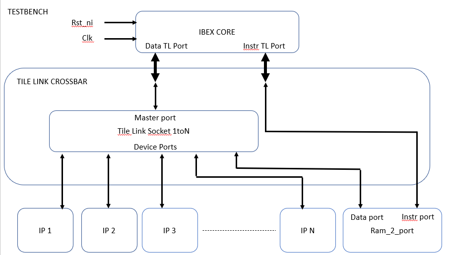

# OpenTitan


## About this branch

This branch has the purpose to integrate OT into the AlSaqr SoC. In order to do so, it is needed to modify the way OT is compiled according to the flow used for AlSaqr, to guarantee the correct integration.
The tool used in AlSaqr is bender, which uses as input a manifest in .yml format. Such manifest specifies which are the depdendencies and the source files for the module to which the .yml file is associated. Dependencies
can be provided as relative/absolute paths or even as github repositories and point either to a git repo containing in the root dir a Bender.yml or even a relative path to a dir containing another
Bender.yml in the same repository. The source section of the manifest specifies which are the .sv files involved and their path (relative to the directory containg that .yml). Suorce files must be defined accordingly to the hierarchy (the top module which instantiates all the other submodules must be put as last source file and so on).
At the end, a tree of dependencies is created starting from the main Bender.yml

## Current Architecture

The architecture under test actually is not the complete earlgray architecture. The ip instantiated in the top module are the only ones needed for the secure boot, removing ips like padframes and so on.
Moreover, the ips are not actually instantiated as they are in the earlgrey arch, they are just instantiated, provided of clk and rst, provided of a connection to the Tile Link Crossbar (autogenerate by .py script starting form a hjson file).
So a TO DO surely is: implement completely the earlgrey arch with only the useful ips, so making all the intermodule connections and eventual multiple instantiation like uart0 uart1 and so on.
Below, a block scheme of the current architecture is shown.



## Test setup

The top module implements the above architecture. The purpose is to test wether the architecture is correctly built and works properly by using the tool
bender and to test wether the communication between the Ibex Core and all the ips through the TL crossbar works as well. To test this communication, the Ibex Core is programmed to write and read a specific register mapped at a specific address for every ip in the arch. The Simulation Controller (a non synthetisable module from the ibex simple system example in the lowRISC repo) prints into a .log file the result of each test. At the end, the simulation controller should end the simulation by sending the $finish command to Questasim, but since the idea is to integrate it into AlSaqr i provissionally placed a while(1) instead then the finish command.

The top module also present an hw counter that raises up a test reset signal after some clock cycles to provide as output from OT interface, this signal could be used to control Ariane's reset for test purposes. A possible upgrade for this could be to generate a register file for the top module so that the test reset can be raised up by software (this register should be connected to a new port in the crossbar that i already created with its memory map address).

## Run the simulation

As first, clone the branch and export the path to the bender binary file in the root dir, then move to scripts dir.

```
git clone -b mciani https://github.com/AlSaqr-platform/opentitan.git

cd opentitan/hw/top_titangrey/scripts

export PATH=<path-to-root-dir-OT>:$PATH

ulimit -n 2048

```
The following scripts will clean the environment from temp files (including the .log), build and compile the software if modified (it can be found at opentitan/hw/top_titangrey/examples/sw/simple_system/hello_test/hello_test.c), run bender update to check for modifications into the various bender files and run the bender script that generates the compile.tcl file used in Questasim. At the end, it opend vsim into the script folder where the compile.tcl is stored.

```
source run_compile.sh

"in Questasim terminal run:"

source compile.tcl

quit

```
At this point, run start.tcl script to run the simulation

```
source start.tcl

```
After few minutes, the test will be over and the software will loop into a while(1). At this point it is needed a break command from questasim. To check if everything went well, check the ibex_simple_system.log file that should present all the prints with all the outcomes of each test (it is removed everytime run_compile.sh is run, so it will be always up to date with your current simulation).

## TO DO:
- Modify the .sh script to automatically run the commands to Questasim and merge it to start script in order to run a single command to run the simulation
- Change the software, the while(1) instead of the halt command is just to avoid that the code stops the simulation while running concurrently with ariane into the Alsaqr repo
- Implement the full earlgrey architecture 
